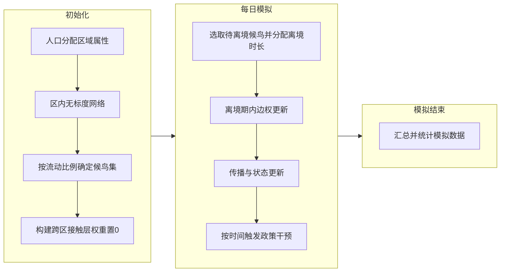

# 4.2.2 跨区域人员流动建模

本文基于BA无标度网络构建多区域病毒传播动力学模型。各区域内部采用独立的无标度接触网络刻画区内接触，区域之间不建立直接接触边，病毒无法沿网络本身跨区传播。跨区传播依赖个体在区域间的流动行为；为刻画该机制，模型引入候鸟集，将具备跨区接触能力的人员子集称为候鸟，仅在该子集与对方区域之间建立跨区接触边。

候鸟集的确定采用按比例抽样的方式。在每个区域内，按给定流动比例从该区节点中无放回随机抽取一定数量的个体并标记为候鸟，两个区域分别独立抽样后得到区域A与区域B的候鸟子集。跨区接触层仅包含候鸟与对方区域节点之间的边：对区域A的每一名候鸟，在区域B中随机选取若干个体作为其在该层上的接触对象；对区域B的每一名候鸟，在区域A中同样随机选取若干接触对象，每人拥有的跨区接触数由模型参数给定。每条跨区边的传播强度由统一的跨区权重参数控制，便于与区内接触层的权重区分；在后续扩展中可根据人员是否处于本区对跨区边权重进行动态调整，以体现人不在彼区则不发生接触的时空约束。该层与区内接触层在拓扑上分离，便于单独调节流动比例、每人跨区接触数及跨区权重，从而与流动率、口岸管控等政策含义对接。

上述设计仅对流动人口赋予跨区边，与现实中仅部分人员参与跨境往来的情况一致，便于与流动率、口岸管控等政策参数对接；通过流动比例与每人跨区接触数两个参数即可调节跨区耦合强度，在实现复杂度和可解释性之间取得平衡。

#### 模型运行流程

本模型在单区域网络模型流程基础上拓展：沿用单区域模型的时间步推进与传播计算框架，在人口属性、接触层构建与边权更新上予以扩展，以刻画跨区流动与离境行为对传播的影响。

**初始化阶段** 依次完成以下步骤。首先，按给定比例对初始人口分配区域属性（country），确定各区域人口子集。随后，在各区域内部按无标度方式（如 BA 网络）生成区内接触网络（区内层），仅含区内边。接着，在各区域内按给定的流动比例（即候鸟比例）无放回抽样确定候鸟集；待双方区域均完成候鸟选取后，在候鸟与对方区域个体之间建立跨区接触层，并将该层边权重初始置为 0，表示仿真起始时尚未发生跨区接触与传播。最后，载入各层传播权重、基础传播参数及政策干预配置，将人口与接触网络载入仿真器并完成初始化。

**每日（每时间步）模拟** 除执行与单区域模型一致的状态更新、接触更新、床位与输入性感染处理及传播计算外，还包含候鸟离境与边权动态更新、以及按时间触发的政策干预。（1）*候鸟离境与边权更新*：从候鸟集中按模型给定规则（如随机）选取本步待离境候鸟，为其分配离境持续时间（如 0–7 天，具体分布由参数设定）。在离境持续期内，将该个体所涉跨区接触边的权重设为 1（表示离境并参与境外传播），将其区内接触边权重设为 0（表示不参与区内传播）；持续期结束后，将上述区内边权重恢复为 1、跨区边权重恢复为 0，表示返回本区。跨区传播通过跨区接触层在每步与区内层一同参与传播计算而自然实现。（2）*政策干预*：在每个时间步可根据仿真日历按时间触发政策干预模块（如隔离、核酸检测、疫苗接种、接触限制等），执行相应非药物干预或药物干预，与 Covasim 的 interventions 机制一致。

**模拟结束后** 对仿真输出进行汇总与统计，包括各区域及全人群的感染数、发病率、时点流行曲线等；在需要时还可统计跨区输入输出病例、候鸟与非候鸟感染占比等指标，用于后续分析与政策评估。

模型运行流程可概括为下图。

